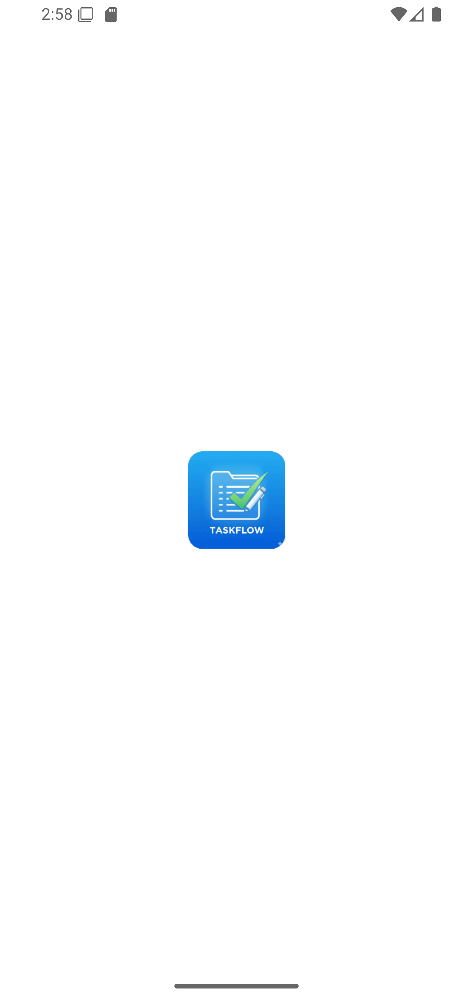
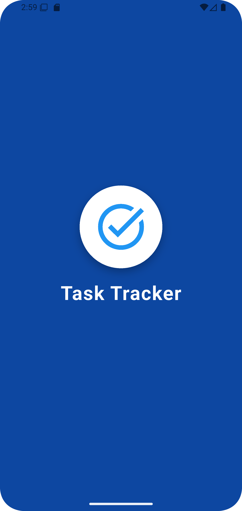
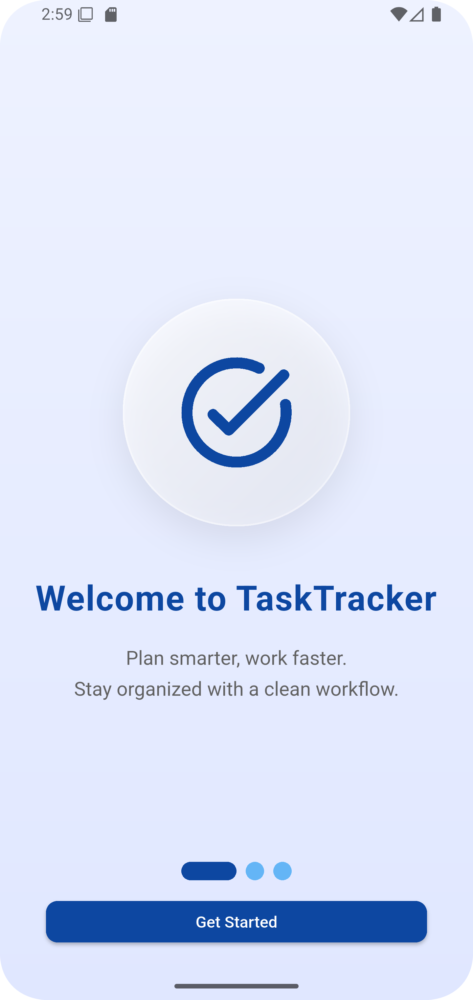
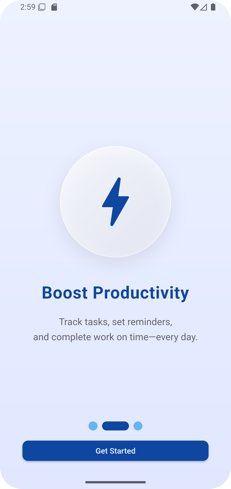
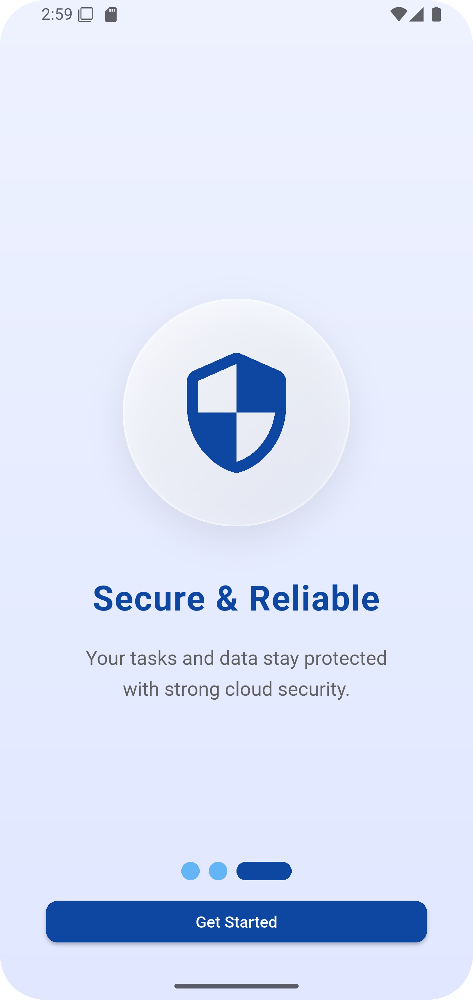
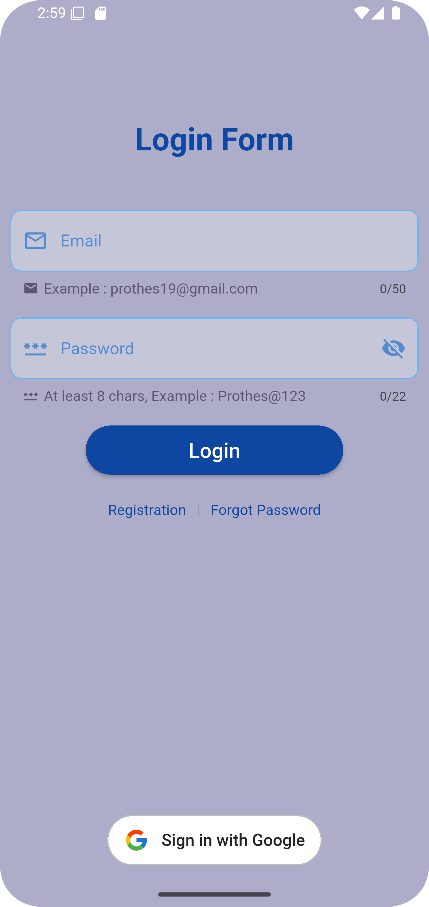
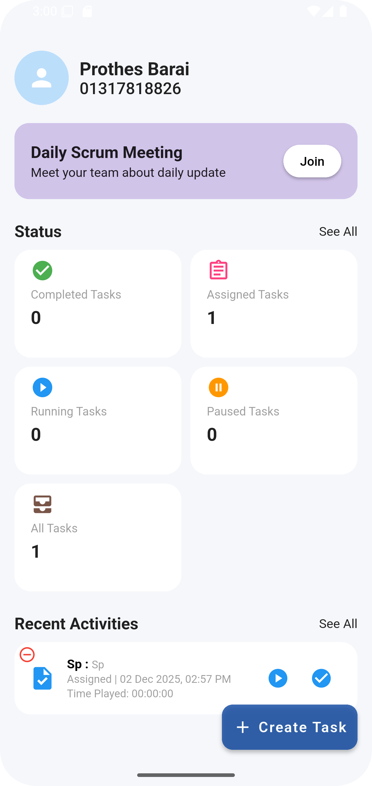
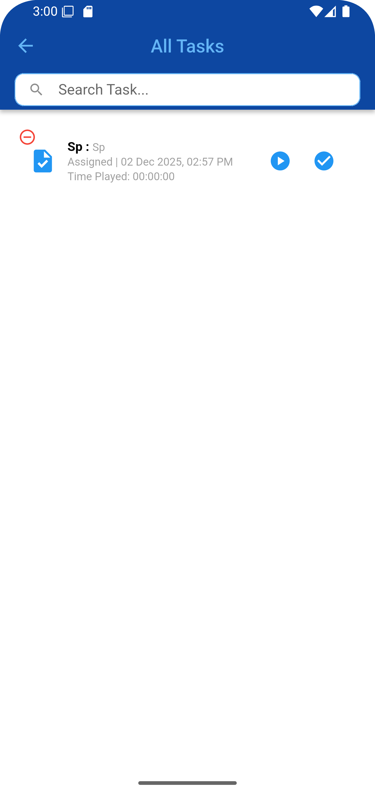

# 📝 Task Tracker --- Professional Flutter Application

## 👋 পরিচিতি

**Task Tracker** হলো একটি সম্পূর্ণ Flutter‑ভিত্তিক মোবাইল অ্যাপ, যার
মাধ্যমে ব্যবহারকারী তার দৈনন্দিন কাজগুলো (Tasks) লিস্ট আকারে যুক্ত, দেখা
ও ম্যানেজ করতে পারে।
------------------------------------------------------------------------

# 📂 প্রজেক্ট স্ট্রাকচার (Beginner‑Friendly)

    task_tracker/
    ├── android/                 → Android বিল্ড ফাইল (Auto-generated)
    ├── ios/                     → iOS বিল্ড ফাইল (Auto-generated)
    ├── lib/                     → মূল Flutter সোর্স কোড
    │   ├── main.dart            → অ্যাপের Entry Point
    │   ├── features/            → Future: ফিচারভিত্তিক ফোল্ডার
    │   ├── models/              → Future: ডেটা মডেল
    │   ├── screens/             → Future: UI Screens
    │   ├── services/            → Future: Local/Cloud services
    ├── test/                    → Unit & Widget Test
    ├── pubspec.yaml             → প্যাকেজ, অ্যাসেট, অ্যাপ ইনফো
    ├── analysis_options.yaml    → লিন্টিং নিয়মাবলি

------------------------------------------------------------------------

# 🎯 অ্যাপ কী করে?

-   ব্যবহারকারী টাস্ক যোগ করতে পারে\
-   লিস্ট আকারে টাস্ক দেখতে পারে\
-   Future‑এ আপনি নিচের ফিচারগুলো যোগ করতে পারবেন:
    -   টাস্ক Edit / Delete\
    -   Task Completion Status\
    -   Local Storage (Hive / SQLite)\
    -   Firebase Authentication + Database\
    -   Notification Reminder\
    -   Professional UI & Animation

------------------------------------------------------------------------

# 🚀 প্রজেক্ট রান করার ধাপ

## 1️⃣ Flutter ইনস্টল করুন

https://flutter.dev/docs/get-started/install

## 2️⃣ রিপো ক্লোন করুন

    git clone https://github.com/prothesbarai/task_tracker.git

## 3️⃣ প্রজেক্ট ডিরেক্টরিতে যান

    cd task_tracker

## 4️⃣ ডিপেন্ডেন্সি ইনস্টল

    flutter pub get

## 5️⃣ অ্যাপ রান

    flutter run

------------------------------------------------------------------------

# 📦 ব্যবহৃত প্যাকেজসমূহ (Dependencies)

## 🎨 UI Enhancements

-   **shimmer** → লোডার অ্যানিমেশন\
-   **smooth_page_indicator** → পেজ ইন্ডিকেটর\
-   **url_launcher** → লিঙ্ক ওপেন

## 🗃 Local Database

-   **hive**, **hive_flutter** → NoSQL Local Storage\
-   **path_provider**, **path** → লোকাল স্টোরেজ পাথ

## ☁ Firebase Integrated Features

-   **firebase_core** → Firebase Initialization\
-   **firebase_auth** → User Authentication\
-   **cloud_firestore** → NoSQL Cloud DB\
-   **firebase_database** → Firebase Realtime DB

## 🔌 Connectivity

-   **connectivity_plus** → নেটওয়ার্ক মনিটর\
-   **internet_connection_checker** → ইন্টারনেট স্ট্যাটাস

## 🔑 Google Sign‑In

-   **google_sign_in_all_platforms** → Google Authentication

## 🚀 Others

-   **provider** → State Management\
-   **flutter_launcher_icons** → App Icon Generation

------------------------------------------------------------------------

# 🔮 Future Features (What You Can Add Later)

-   Dark Mode\
-   Offline Sync\
-   Firebase Push Notification\
-   Advanced Dashboard\
-   Profile & User Settings\
-   Drag‑and‑Drop Task Sorting\
-   Multi‑Category Task Filtering\
-   Cloud Backup & Restore

------------------------------------------------------------------------

# 📷 Screenshot Section

<table>
  <tr>
    <td></td>
    <td></td>
    <td></td>
    <td></td>
  </tr>
  <tr>
    <td></td>
    <td></td>
    <td></td>
    <td></td>
  </tr>
</table>

------------------------------------------------------------------------

# 🙋 Author

**Prothes Barai**\
Software Engineer

------------------------------------------------------------------------

# 📄 License

MIT License

